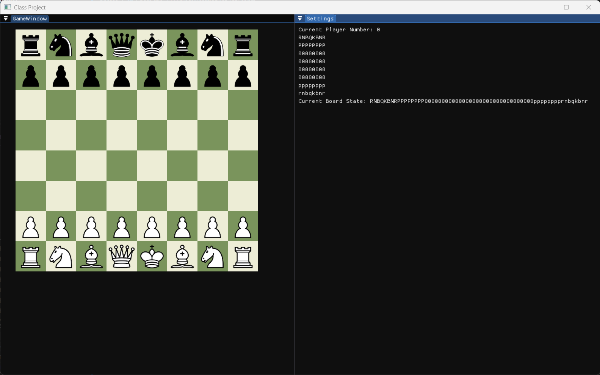

2/13/2025
Game loads from FEN string.

I compared the assembly code in the piece checking in `FENtoBoard()` in two different cases: (1) using a case-switch (and no variable to store the lower-case version of the piece char), and (2) using my original implementation with the variable + an if-else-if structure. I found that in case (2), there were ten less machine instructions. It's not a huge difference, but it validated my original direction, which I was unsure about due to the variable declaration. I also tried a version of the if-else-if without the variable declration, and it added five lines in addition to the case structure. So it seems that version (2) is, by a tiny margin, the preference. 

**Moves**
Full disclosure: last week, I had playtests in 171, so I didn't have a lot of bandwidth to work on the first move sets (pawns, knights, kings). I followed along with lecture recordings. I will hopefully have time soon to watch Sebastian Lague's chess videos and maybe improve my code. I made some notes with comments in areas where I plan to replace stuff with templates so my code is faster.

